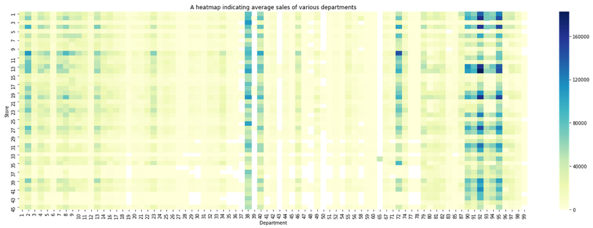
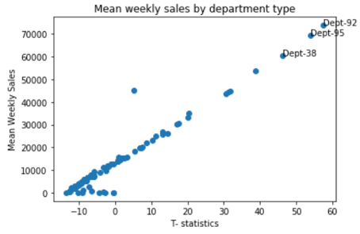
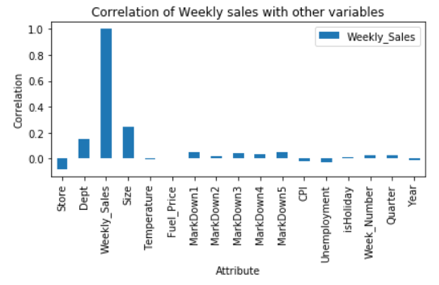
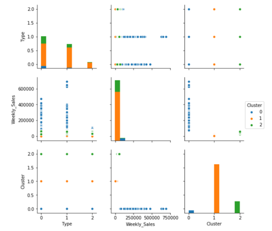
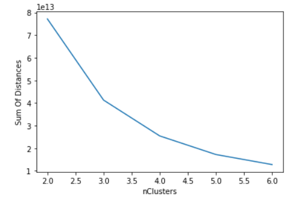
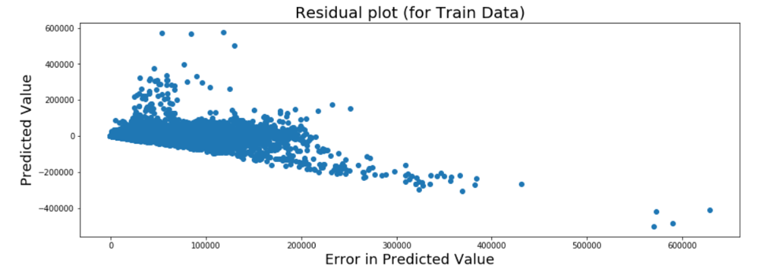
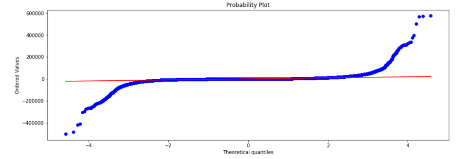
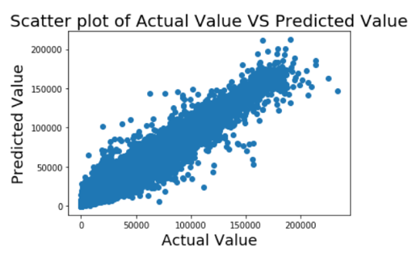
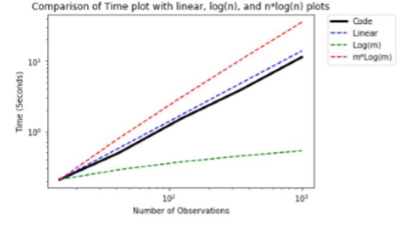

# Walmart-Store-Sales-Forecasting

## Executive Summary
Walmart is one of the largest retailers in the world and it is very important for them to have accurate forecasts for their sales in various departments.Since there can be many factors that can affect the sales for every department, it becomes imperative that we identify the key factors that play a part in driving the sales and use them to develop a model that can help in forecasting the sales with some accuracy.

For this project, we have used the dataset available from ‘Walmart Store Sales Forecasting’ project that was available on Kaggle. 
In this dataset, we have weekly sales data for 45 stores and 99 departments for a period of 3 years. In addition, we had store and geography specific information such as store size, unemployment rate, temperature, promotional markdowns etc.
Using these factors, we needed to develop a regression model that can forecast the sales and is also computationally efficient and scalable.

In this project, we conducted multiple linear regression to predict the future sales. There were several different factors that we analyzed in our regression model starting with a full model with all the variables and then moving towards a reduced model by eliminating insignificant variables. We used several different exploratory analyses to identify the key variables for our regression equation such as correlation plots, heatmaps, histograms etc.

The key issues that we have faced in this analysis is the large dataset that resulted into several computational challenges because of which we had to modify our approach in addressing the problem. We also faced significant challenges in identifying the right variables on which the analysis could be conducted.

Few other time series forecasting models could have been used as the weekly sales is highly dependent on the past year. Moreover, ARIMA modelling techniques like exponential smoothening and holt winters could have helped us capture the seasonality in the model in a better way. Furthermore, ARIMAX model would have enabled us to have an accurate time series model based on previous weeks of data as well as factor in few important variables like holiday and department type to get an even better accuracy.

## Conclusion: 
In conclusion, we find that our regression equation is quite accurate (84.5% accuracy) in predicting the weekly sales. Walmart can use it to forecast the sales better. They need to focus on the inventory planning of key departments like 38,92 and 95. They need to overhaul the Markdowns that are given currently as they are not having the intended impact on sales. They need to focus on the year-end inventory as week 51 and 52 play a crucial part in predicting sales.
